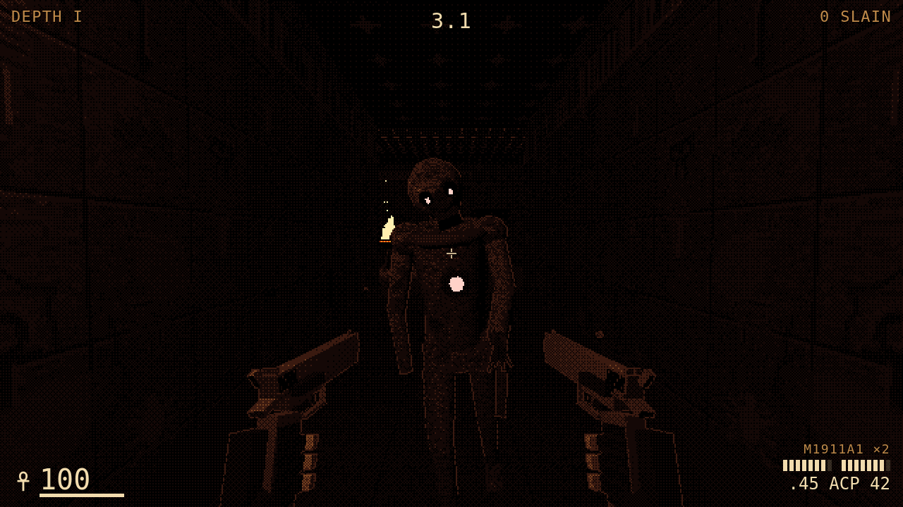
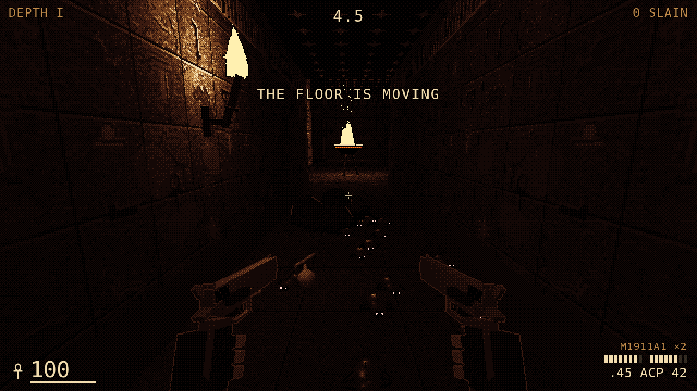
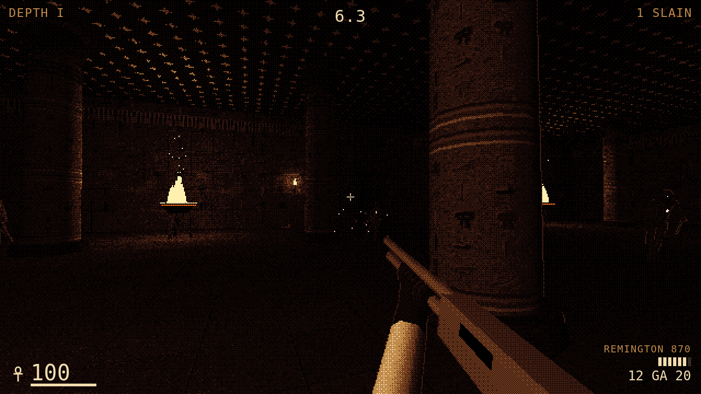
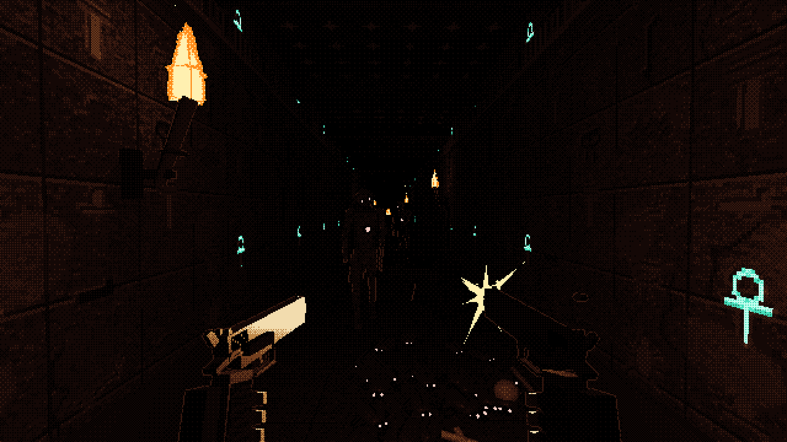
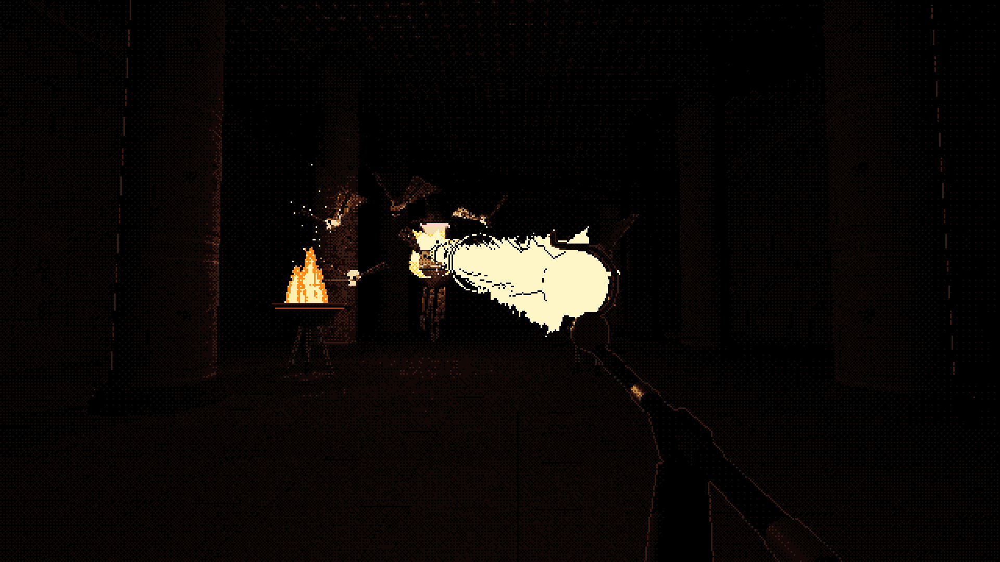
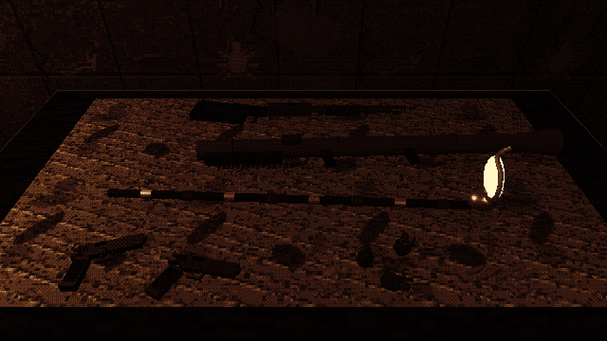

# Hell Hole

A first-person tomb shooter for the browser: Devil Daggers' dithered darkness, Powerslave's
Egyptian tombs, a 1980s soldier with twin 1911s. Torch-lit, and every level goes further down.

**Stage: Depth I is playable.** [Play it](https://claude.ai/artifact/LgwBE6F1kzjzdbSh2d6EX7) ·
[concept board](https://claude.ai/artifact/AfyjwVC31uRyJ9aMe5WBgo) · [GAME_DESIGN.md](GAME_DESIGN.md)

| | | |
|---|---|---|
|  |  |  |
|  |  |  |

## Play

No build step. Serve the folder (ES modules need a server) and open it:

```
python3 -m http.server 4190
open http://localhost:4190/
```

| | Keyboard + mouse | Gamepad | Touch |
|---|---|---|---|
| Move · jump | WASD · Space | Left stick · A | Left thumb · JUMP |
| Right gun · left gun | Left click · right click | RT · LT | R · L |
| Reload · grenade | R · G (or middle click) | X · B | RELOAD · GREN |
| Swap weapon | Q · wheel · 1 / 2 | Y | SWAP |
| Pause · mute | Esc or P · M | Menu | II |

Each trigger fires its own 1911. A round through the heart scarab in a mummy's chest kills it.
Settings: look (Dagger, Pigment, Sin City), resolution (270 / 360 / 540 lines), brightness,
mouse sensitivity, invert, torch shadows. URL overrides: `?style=pigment&lines=270`.

## Verify

```
node tools/sim-check.mjs                     # 42 checks: maps finishable, heart shots, reloads, swarms, grenades, shrine
python3 -m http.server 4190 &
node tools/smoke.mjs                         # desktop + phone: boot, play, pause, the door; 0 console errors, no scroll
node tools/render-concepts.mjs [shot ...]    # re-render the concept art into concept/shots/
```

CI (`.github/workflows/pages.yml`) runs the sim checks on every push and deploys to GitHub Pages
only from `main`.

## Code map

```
js/sim/        the rules: pure, no three.js, no DOM (Node runs them in tools/sim-check.mjs)
  tuning.js      every number, each with the reason it has that value
  levels.js      the depths as ASCII maps
  level.js       parse a map; wall push-out, ray casts, line of sight, the BFS path field
  world.js       createWorld(depth) · step(world, control, dt) · events
js/render/     three.js view
  dread.js       the Dread post pass: Dagger ramps, Pigment palette, Sin City ink; material roles; depth edges
  tomb.js        tomb kit: corridors, halls, columns, shaft, torches, braziers, doors, props, bake()
  textures.js    procedural canvas textures (painted glyph walls, wraps, woodland, flames, bursts)
  monsters.js    the bestiary · guns.js twin 1911s · weapons.js 870, bazooka, Mk 2, Staff of Ra
  level-view.js  a map as merged geometry + props + the torch light pool
  actors.js      baked mummies, instanced scarab swarms, grenades; Fx particles and explosions
  viewmodel.js   the hands: recoil, reloads, the swap, the throw, bob and sway
js/input/      keyboard + mouse (pointer lock), gamepad, touch → one control object per step
js/audio/      sfx-synth.js (dr-mow) + the game's sound vocabulary; no audio files
js/ui/hud.js   the HUD
concept/       concept shot composer (concept/?shot=…) and the concept board
```

## Lineage

| From | Reused |
|---|---|
| [mstr-gme-dsgn-tmpt](https://github.com/mtd-public/mstr-gme-dsgn-tmpt) | house rules (sim/render split, TUNING with reasons, concepts first), three.js r160, touch-zoom-guard |
| [labyrinth-larry](https://github.com/mtd-public/labyrinth-larry) | the Sin City ink pass (material roles + post pass), the torch light pool |
| [Vertical-Vantage](https://github.com/mtd-public/Vertical-Vantage) | first-person input (pointer lock, gamepad, touch), the Egypt tomb kit ideas |
| [dr-mow](https://github.com/mtd-public/dr-mow) | the PS1 dither pipeline, sfx-synth |
