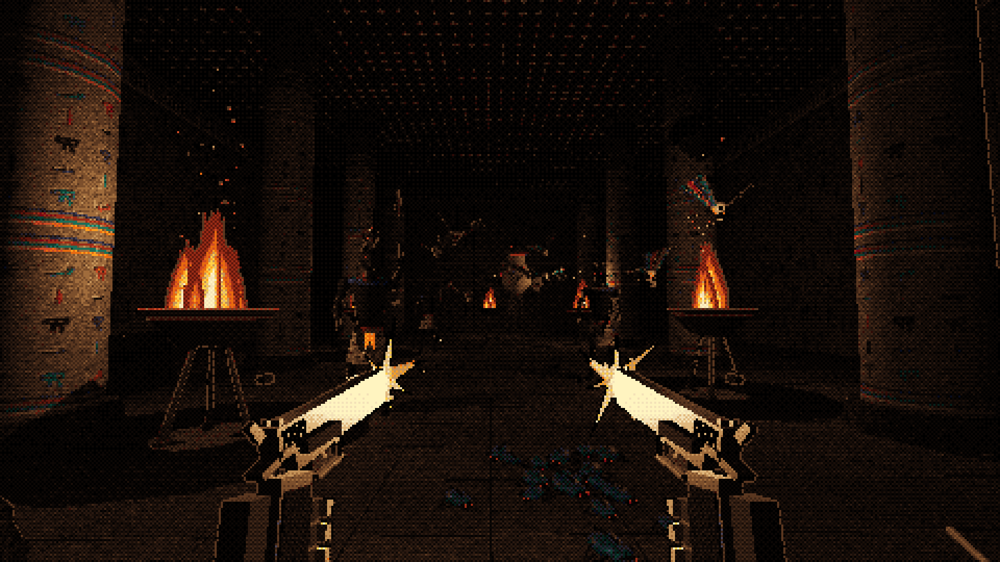
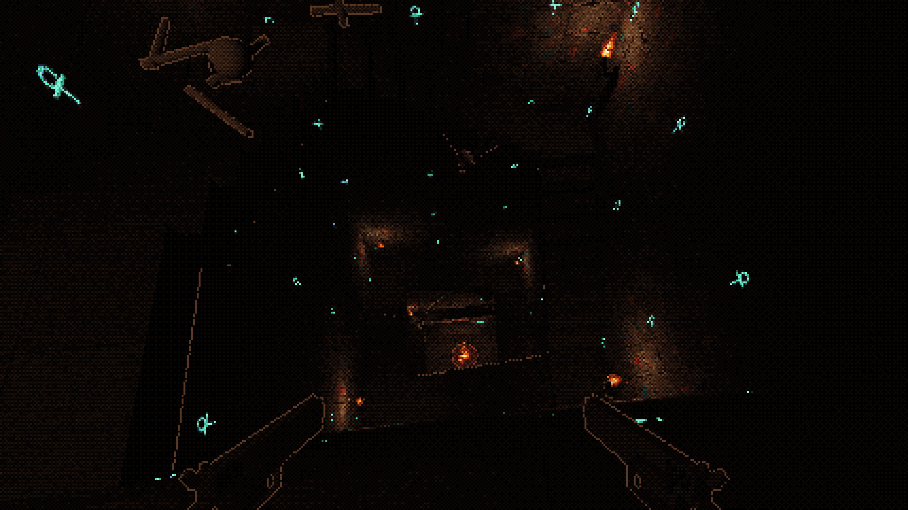
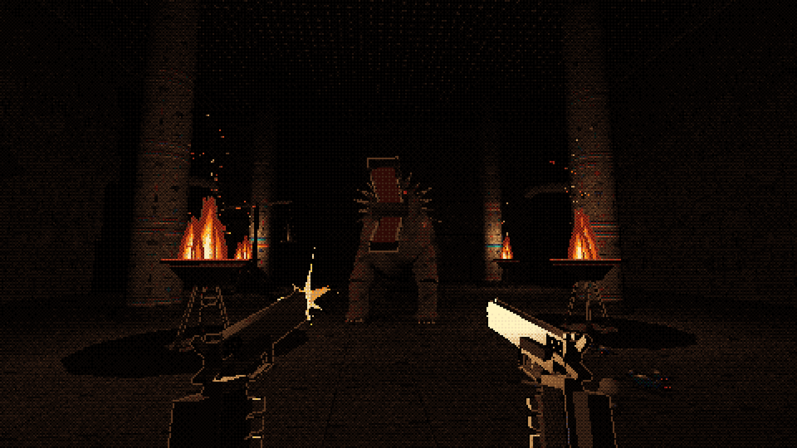

# Hell Hole

A first-person tomb shooter for the browser: Devil Daggers' dithered darkness, Powerslave's
Egyptian tombs, twin 1911s. Torch-lit, multi-colour, and every level goes further down.

**Stage: concept art.** See [GAME_DESIGN.md](GAME_DESIGN.md) and the
[concept board](https://claude.ai/artifact/AfyjwVC31uRyJ9aMe5WBgo).

| | | |
|---|---|---|
|  |  |  |
|  |  |  |

## Concept shots

Every image is rendered by the real pipeline (three.js r160, vendored, no build step):

```
python3 -m http.server 4190                  # from the repo root
open http://localhost:4190/concept/           # menu of shots and styles
open http://localhost:4190/concept/?shot=hallway&style=pigment
node tools/render-concepts.mjs [shot ...]     # headless: concept/shots/*.png (+ x4/)
```

`style` is `pigment` (default), `dagger` or `sincity`; `h` sets the internal lines (270); `debug=1`
adds flat light. The render tool needs Playwright and Chromium.

## Code map

| File | What it does |
|---|---|
| `js/render/dread.js` | The Dread post pass: Pigment palette dither, Dagger ramps, Sin City ink; material roles; depth edges |
| `js/render/textures.js` | Procedural canvas textures: painted glyph walls with glow maps, floors, wraps, flames, bursts, beam |
| `js/render/tomb.js` | Tomb kit: corridor, hall, papyrus column, burial shaft, stairs, pylon doorway, torches, braziers, props |
| `js/render/monsters.js` | The Wrapped, scarabs, Jackal Warden, ba, Canopic Mother, Serqet, Ammit |
| `js/render/guns.js` | Twin M1911A1 viewmodel, hands, muzzle flash |
| `js/render/weapons.js` | Trench gun, bazooka, Mk 2 grenade, Staff of Ra; explosion, rocket, sun beam |
| `concept/concept.js` | Shot composer (`?shot=`) |
| `concept/board.html` | The concept board (published as an artifact) |
| `tools/render-concepts.mjs` | Headless renderer for every shot |
