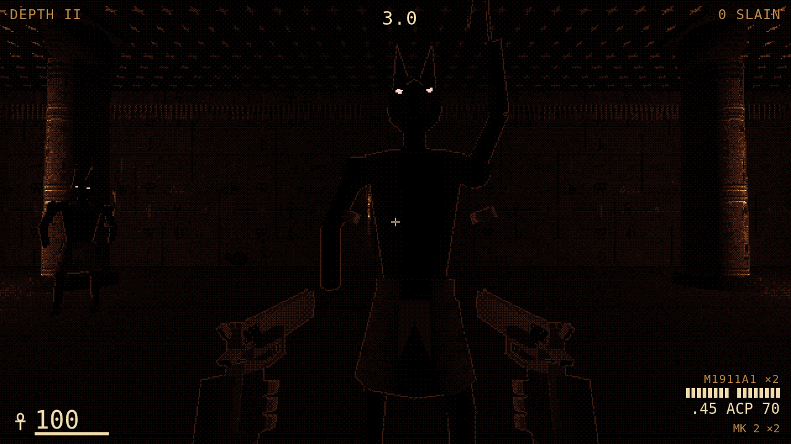
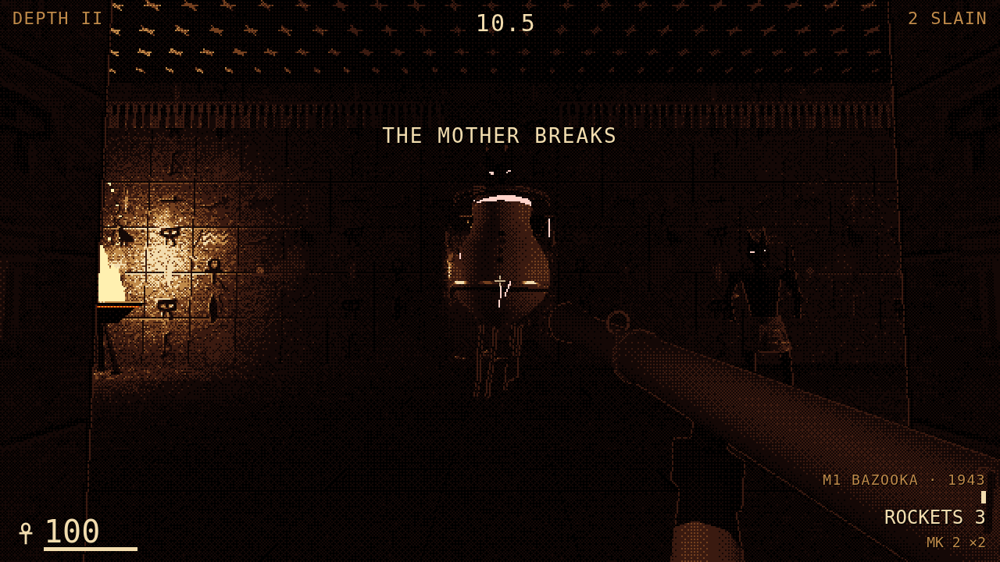
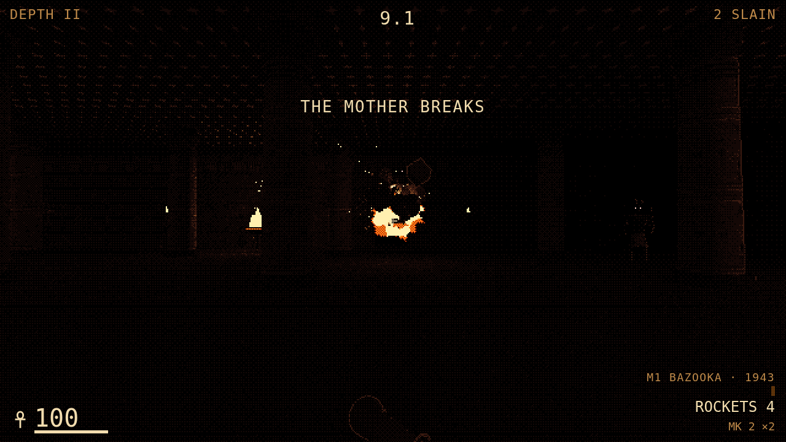

# Hell Hole

A first-person tomb shooter for the browser: Devil Daggers' dithered darkness, Powerslave's
Egyptian tombs, a 1980s soldier with twin 1911s. Torch-lit, and every level goes further down.

**Stage: Depths I and II are playable.** [Play it](https://claude.ai/artifact/LgwBE6F1kzjzdbSh2d6EX7) ·
[concept board](https://claude.ai/artifact/AfyjwVC31uRyJ9aMe5WBgo) · [GAME_DESIGN.md](GAME_DESIGN.md)

| | | |
|---|---|---|
|  |  |  |
|  |  |  |
|  |  |  |

## Play

No build step. Serve the folder (ES modules need a server) and open it:

```
python3 -m http.server 4190
open http://localhost:4190/
```

| | Keyboard + mouse | Gamepad | Touch |
|---|---|---|---|
| Move · jump | WASD · Space | Left stick · A | Left thumb · JUMP |
| Right gun · left gun | Left click · right click | RT · LT | R · L |
| Reload · grenade | R · G (or middle click) | X · B | RELOAD · GREN |
| Swap weapon | Q · wheel · 1 / 2 / 3 | Y · LB · D-pad ←/→ | SWAP |
| Pause · mute | Esc or P · M | Menu | II |
| Menus | mouse · Tab · Enter | D-pad or left stick · A · B back | tap |

Each trigger fires its own 1911. A round through the heart scarab in a mummy's chest kills it; a
Jackal Warden takes triple to the head and staggers if you hurt it fast; the Canopic Mother takes
double through the crimson seam under her lid, and her ba die with her. The bazooka blows back
on you if you fire it with your back to a wall. Reach the door and you descend with what you
carry (at least 60 health); the title screen lets you start from any depth you've reached
(`?depth=2` skips there).
Settings: look (Dagger, Pigment, Sin City), resolution (270 / 360 / 540 lines), brightness,
mouse sensitivity, invert, torch shadows. URL overrides: `?style=pigment&lines=270`.

## Verify

```
node tools/sim-check.mjs                     # 98 checks: both depths finishable, every monster's rules, every weapon, the carry-over
python3 -m http.server 4190 &
node tools/smoke.mjs                         # desktop (Depth I → door → Depth II, a rocket), a stub gamepad in the menus, phone
node tools/render-concepts.mjs [shot ...]    # re-render the concept art into concept/shots/
```

CI (`.github/workflows/pages.yml`) runs the sim checks on every push and deploys to GitHub Pages
only from `main`.

## Code map

```
js/sim/        the rules: pure, no three.js, no DOM (Node runs them in tools/sim-check.mjs)
  tuning.js      every number, each with the reason it has that value
  levels.js      the depths as ASCII maps
  level.js       parse a map; wall push-out, ray casts, line of sight, the BFS path field
  world.js       createWorld(depth, { carry }) · step(world, control, dt) · loadout(world)
  common.js      events, damage, death, waking, hit shapes, steering
  arms.js        1911s, the 870, the bazooka, grenades, rockets, blasts
  enemies.js     mummies, scarabs, jackals, ba, the Canopic Mother
js/render/     three.js view
  dread.js       the Dread post pass: Dagger ramps, Pigment palette, Sin City ink; material roles; depth edges
  tomb.js        tomb kit: corridors, halls, columns, shaft, torches, braziers, doors, props, bake()
  textures.js    procedural canvas textures (painted glyph walls, wraps, woodland, flames, bursts)
  monsters.js    the bestiary · guns.js twin 1911s · weapons.js 870, bazooka, Mk 2, Staff of Ra
  level-view.js  a map as merged geometry + props + the torch light pool
  actors.js      baked monsters (mummy, jackal, ba, Mother), instanced scarabs, rockets, grenades; Fx
  viewmodel.js   the hands: recoil, reloads, the swap, the throw, bob and sway
js/input/      keyboard + mouse (pointer lock), gamepad, touch → one control object per step
js/audio/      sfx-synth.js (dr-mow) + the game's sound vocabulary; no audio files
js/ui/         hud.js the HUD · menu-nav.js gamepad navigation for the DOM menus
concept/       concept shot composer (concept/?shot=…) and the concept board
```

## Lineage

| From | Reused |
|---|---|
| [mstr-gme-dsgn-tmpt](https://github.com/mtd-public/mstr-gme-dsgn-tmpt) | house rules (sim/render split, TUNING with reasons, concepts first), three.js r160, touch-zoom-guard |
| [labyrinth-larry](https://github.com/mtd-public/labyrinth-larry) | the Sin City ink pass (material roles + post pass), the torch light pool |
| [Vertical-Vantage](https://github.com/mtd-public/Vertical-Vantage) | first-person input (pointer lock, gamepad, touch), the Egypt tomb kit ideas |
| [dr-mow](https://github.com/mtd-public/dr-mow) | the PS1 dither pipeline, sfx-synth |
